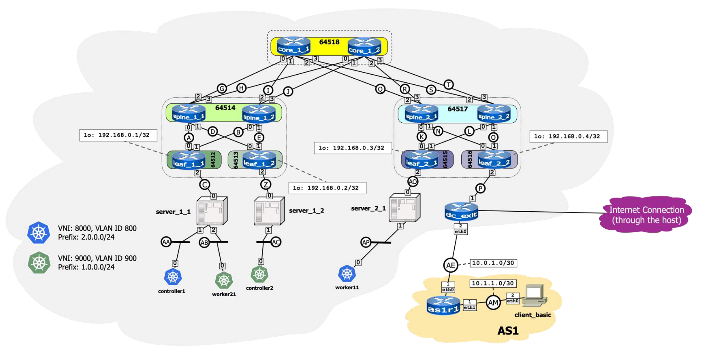

# IK2227-Cloud-Infra

## BASIC

Using Kathará, implement the network depicted above and described below: 

- [x] Create the Fat-Tree topology (routers and servers)    
  - [x] The grey boxes at the endpoint of a link are the interface numbers (the prefix eth is often omitted for brevity)  
    - For example, server_1_1 has three interfaces labelled 0, 1, and 2, corresponding to eth0, eth1, and eth2. 
  - [x] The white box above the interface number is the last byte of the IP address in the subnet  
    - For example, if the subnet is 10.1.1.0/30, and the white box number is 2, the IP is 10.1.1.2/30  
    - If the white box is omitted, no IP address needs to be configured on the interface 
  - [x] You need to specify all the devices metadata (hint: take look at the lab.conf file of Lab 2)  
- [x] Configure BGP (both underlay and EVPN) 
  - [x] Select a unique Router ID of your choice for each router  
  - [x] Use unnumbered peerings with link-local IPv6 addresses (remember to enable IPv6 in lab.conf)  
  - [x] On Leaf nodes, configure the peerings on the loopback port (IP of each Leaf shown)  
  - [x] Advertise correct address families to neighbours (both IPv4 unicast and EVPN)  
    - Hint: remember to add the route-map for announcing the loopback IP 
- [ ] Configure VXLAN and VLAN on the Leaf nodes and the servers 
  - [ ] You must configure ONLY the required VTEPs/VLANs in each node 
    - E.g., server_1_2 must only have the VTEP for VNI=9000 and VLAN=900 
  - [ ] The only exception is leaf_2_2, that must expose both VTEPs/VLANs  
    - They allow the Kubernetes nodes to exit on the host’s Internet connection 
- [ ] After configuring the network, check that the two Kubernetes clusters are healthy 
  - [ ] Log into controller1 and controller2 separately and check that all system resources are running  
- [ ] Configure client_basic interface and its default gateway (towards as1r1) 
  - [ ] Its configuration folder with all the required files is already provided by the lab